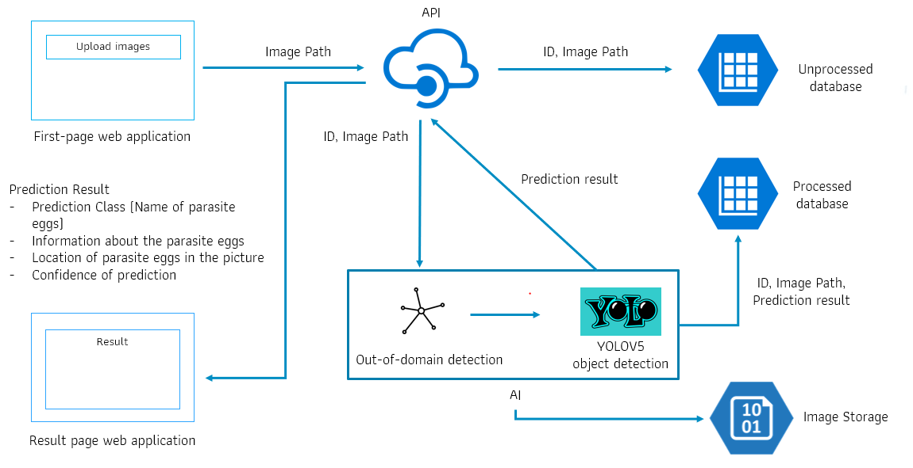

# Parasite egg detection
In the real-world situation, deploying parasite egg detection in the parasite learning chatbot could receive an input that has different distribution from training data. Out-of-domain images in parasite egg detection can lead to incorrect predictions. In testing, we removed out-of-domain images from test data, and the result shows that predictive performance was improved. Solving out-of-domain image problems, we apply out-of-domain images detection to parasite egg detection by using temperature scaling and adding small perturbations to the input. The difference of the SoftMax score distributions can separate in-domain images from out-of-domain images. We abstain out-of-domain images from prediction for more effective detection.

<p align="center">

</p>

## Running the code
### Forking this project to your Github and cloning the project to your device
```
git clone [HTTPS link]
```
## Install dependencies
```
pip install -r requirements.txt
```
## Setup
```
pip install wandb

import torch
from IPython.display import Image, clear_output  # to display images

clear_output()
print(f"Setup complete. Using torch {torch.__version__} ({torch.cuda.get_device_properties(0).name if torch.cuda.is_available() else 'CPU'})")
```
### Running API
Here is an example code of running API, run
```
cd yolov5-master
python My_own_api.py
```
### Going to parasite egg detection webpage
1. Open your internet browser 
2. Go to http://127.0.0.1:8080/myhome
3. Choose your images that you would like to detect
4. Upload your images
5. You can see the detection result that show classes of parasite eggs, bounding boxes and class confident scores
